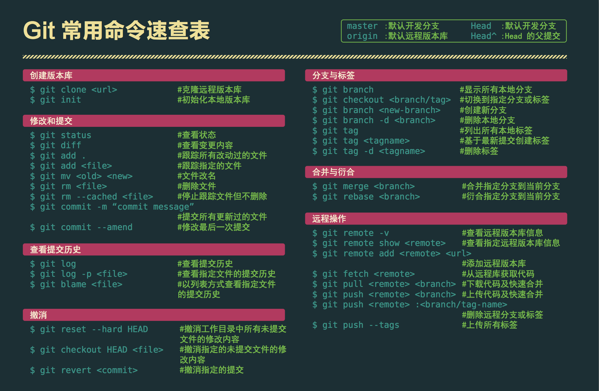

## 常用操作命令速查表



## git 分析理解

- git 分为三部分：本地仓库、暂存区、远程仓库（git 各网站）
- 本地仓库需要与远程仓库创建连接，或直接 clone
- git commit 会将修改内容先提交到暂存区，git push 后才会上传到远程仓库

### 1.创建 git 远程仓库

- 在 github 或 gitlab 等一些平台上，新建仓库

### 2.创建 git 本地仓库

新建文件夹并打开 git bash

```bash
//初始git仓库
git init
```

### 3.与 git 远程仓库关联连接

- 方式一：（可不用初始化 git 仓库，因为远程拉取就有）

```bash
git clone git@github.com:username/repositoryname.git （shh仓库地址，需要添加密钥）
git clone https://github.com/dreamChaser-lcc/xnsj.git （https仓库地址不需要密钥）
```

`username`为 git 登录账户名,`repositoryname`为仓库名，`仓库地址也可从git上复制`

- 方式二：

```bash
git remote add origin xxx //xxx为远程仓库地址如上

git remote -v  //查看是否添加成功

git fetch origin  //向远程仓库拉取内容

git branch -a //查看远程分支

//操作一：切换分支
git checkout xxx //xxx分支名
//提交文件
git add . //将所有文件放入暂存区
git commit -m xxx //xxx描述信息 添加描述并提交
git push

//操作二：创建分支并切换
git checkout -b xxx //xxx新分支
git add xxx //xxx文件名
git commit  -m xxx //xxx描述

//当第一次上传时，git push 如下
git push --set-upstream origin xxx //xxx为新分支的名，由于新分支没有历史流，远程没有记录，所以需要--set-upstream
或
git push -u origin xxx

```

:::warning
第一次推送 master 分支时，加上了-u 参数，Git 不但会把本地的 master 分支内容推送的远程新的 master 分支，还会把本地的 master 分支和远程的 master 分支关联起来，在以后的推送或者拉取时就可以简化命令
:::

- 建立连接后

```bash
mkdir test  //创建文件夹或文件
git add .  //将目录下所有文件放入暂存区
或 git add test //单个文件放入暂存区
git commit -m xxx //提交 xxx为描述信息
git push
```

## 添加 SSH 密钥

添加后**才能使用 ssh 远程仓库地址**与本地创建连接，否则只能使用 https 地址创建连接

- 设置 git 用户名，邮箱，密码（全局配置）

```bash
git config --global user.name xxx  //xxx为用户名
git config --global user.eamil xxx  //xxx为邮箱
git config --global user.password  //xxx为密码
git config --list //查看所有配置
git config user.name //查看用户名
```

- 生成密钥命令

```bash
 ssh-keygen -t rsa -C  xxx  //xxx为git邮箱或用户名
```

- 查看生成的密钥
  密钥文件默认路径：c 盘->用户->自己的用户名->.ssh （C:\Users\电脑用户名\\.ssh）
  目录下的文件如下：

  

- **id_rsa 为私密钥**，**id_rsa.pub 为公钥**
- 将**公密钥**内容全部复制到网站 git->settings->SSH and GPG keys
  
  - 将公钥复制到**key**
    随意输入 Title 然后添加既可。

## github 中 https 连接换成 ssh 连接方式

为什么要换？

- github 更新后，https 方式每次提交都需要获取`token`重新登录
- 替换后可以不需要每次去 github 获取 token

```bash
// 查看已连接的远程连接
$ git remote -v
// 替换 xxx 为ssh方式的连接
$ git remote set-url origin xxx
```

## 其他命令

```bash
git pull origin master --allow-unrelated-histories
```

:::tip
--allow-unrelated-histories 会将本地分支和远程分支内容合并
:::

| 命令                               | 备注                                        |
| :--------------------------------- | :------------------------------------------ |
| git status                         | 查看工作目录状态                            |
| git branch -v                      | 查看所有本地分支                            |
| git branch -a                      | 查看所有远程分支                            |
| git branch -m xxx xxx              | 修改分支名称，第一个 xxx 为旧名称，第二为新 |
| git push origin --delete xxx       | 删除远程分支 xxx                            |
| git branch -d xxx                  | 删除本地分支 xxx                            |
| git checkout xxx                   | 切换分支，xxx 为分支名                      |
| git merge xxx                      | 合并分支，xxx 为分支名                      |
| git remote -v                      | 查看已连接仓库                              |
| git pull                           | 从远程分支拉取代码                          |
| git push                           | 上传代码                                    |
| git fetch origin                   | 从远程拉取信息                              |
| git branch -u origin/master master | 从远程拉取 master 分支                      |
| git rm -f xxx                      | 强制删除 xxx 文件，暂存区工作区都会被删除   |
| git rm --cache xxx                 | 只从暂存区删除，文件还存在工作目录          |

## 合并分支

转载： [合并分支的具体方法](https://yanhaijing.com/git/2017/07/14/four-method-for-git-merge/).

## 上传大于 100MB 文件

- 1.下载并安装 Git LFS 程序 [下载地址](https://docs.github.com/en/github/managing-large-files/installing-git-large-file-storage).
- 2.git 安装 lfs (会在.git 同级目录生成 .gitattributes 配置文件)

```bash
git lfs install
```

- 3.配置(所有 zip 文件通过 lfs 上传,可按需配置)

```bash
git lfs track "*.zip"
```

- 4.上传配置文件(需要先将 lfs 配置文件上传到远程仓库才能上传大文件)

```bash
git add  .gitattributes
git commit - m description
git push
```

- 5.上传大文件
  git add xxx //xxx 为大文件，并且是.zip 格式(因上面配置的是 zip)
  git commit -m description
  git push

## git 版本回退代码

- 为了不覆盖原始代码,一般创建新分支回退

```bash
git checkout -b xxx  //同步当前分支所有内容到xxx分支
```

下面所有的操作都是在 xxx 分支进行

- 查看需要回退的版本

```bash
 git log  //commit log
```


- 根据 head 回退版本

```bash
  git reset head   //如上图
```

- 强力上传到远程仓库（上传后回退之间的记录都会清除）

```bash
  git push orgin xxx -f  或者
  git push orgin xxx --force
```

- 成功上传修改后，合并修改内容到原分支(可忽略)

```bash
git checkout preBranch
git merge xxx  //xxx为新建分支
(修改合并冲突)
git push
```
