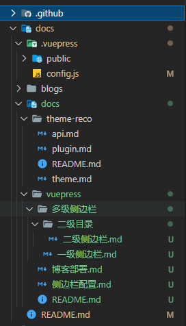
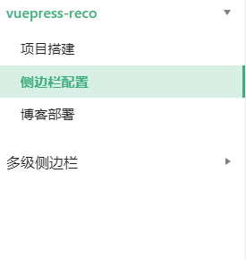

## 配置文件
.vuepress/config.js
```
modules.exports={

 themeConfig: {
  sidebar: {
      "/docs/theme-reco/": ["theme",         // 根据目录自动索引，标题即为侧边的title 
      "api",
      "plugin"
      ], 
      "/docs/vuepress/": [                   // 多级侧边栏
        {
          title: "vuepress-reco",                     
          collapsable: true,                 // 是否可展开关闭，默认true
          children: [ 
            {
              title: "项目搭建",              // 自定义侧边栏的title
              path: "./",                    // 跳转路径 这里为/docs/vuepress/README.md
            },
            {
              title: "侧边栏配置",            // 自定义title
              path: "侧边栏配置",             // 跳转路径 这里为/docs/vuepress/侧边栏配置.md
            },
            "博客部署",                // 跳转路径为/docs/vuepress/博客部署.md title为md文件的title
          ],
        },
        {
          title: "多级侧边栏",
          collapsable: true,
          children: [
            "多级侧边栏/一级侧边栏",
            {
              title: "二级目录",
              collapsable: false,
              children: ["多级侧边栏/二级目录/二级侧边栏"],
            },
          ],
        },
      ],
    },
  }

}

```
## 项目对应路径

## 效果
