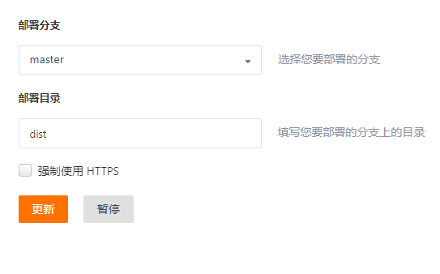
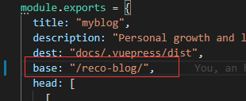

## 部署流程
   常规的部署流程
   1. 更新博客
   2. 本地npm run docs:build构建文件
   3. 将构建的静态资源文件切换到部署的分支
   4. 启用Page服务将静态资源文件跑起
## Github Page + Github Action部署
 相关步骤:
   1. 生成Github token令牌
   2. 进入项目 将token令牌设置到`Settings/Secrets`中
   3. .github/workflows/main.yml目录下编写在Action，[示例代码](https://github.com/dreamChaser-lcc/reco-blog/blob/master/.github/workflows/main.yml)
   4. 完成上述步骤，提交代码就会自动部署Github Page上 
   5. 在项目中的Action可以查看部署日志
 :::tip
 由于Github支持CI/CD持续集成部署，所以可以利用Github Action实现自动部署
 :::
## Gitee page 部署
 相关步骤：
 1. npm run docs:build 构建打包代码
 2. 打包生成的静态资源文件，上传到Gitee，deploy分支
 3. 打开Gitee Page服务
 4. 选择发布分支
 :::tip
   dist 是静态资源存放的项目目录，如上配置对应的是master分支中，根目录下dist目录
 :::   
 

## FQA
 ### 部署后出现页面404
   - 引起原因是因为静态资源对应根目录不对，导致找不到文件
   - 解决在配置文件(.vuepress/config.js)下修改base，即修改项目根目录
   - /reco-blog/ 在这里指定的是git项目名称
  
 
 ### Github Page 和Gitee Page对比
 - Github优点在于只要提交代码即通过脚本进行自动部署，但由于是国外地址访问速度会有所限制
 - Gitee相比之下访问速度更快，浏览更友好，但需要手动打包及部署
   
## 参考连接

[Github Action自动部署](https://vuepress-theme-reco.recoluan.com/views/other/github-actions.html)

[阮一峰 github Action入门教学](http://www.ruanyifeng.com/blog/2019/09/getting-started-with-github-actions.html)
